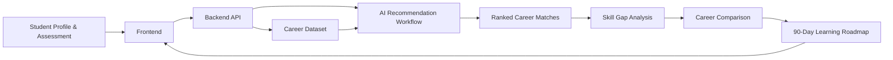

<div align="center">

# 🧭 PathPilot AI

### Turning career confusion into confident decisions.

**An explainable AI career decision and education planning platform**

[](https://github.com/Titiksha-P/PathPilot-AI)
[](https://github.com/Titiksha-P/PathPilot-AI)
[](https://github.com/Titiksha-P/PathPilot-AI)

</div>

---

## The Problem

Most students do not suffer from a lack of information. They suffer from **decision overload**.

Career portals often provide lists, generic tests, scattered resources, or unexplainable recommendations. Students still struggle to answer:

- Which career genuinely fits me?
- Why does it fit me?
- What skills am I missing?
- How do two career paths compare for my profile?
- What should I do next, in a realistic sequence?

## The PathPilot AI Vision

PathPilot AI is designed as a **career decision system**, not merely a recommendation list.

It combines student profile intelligence, explainable career ranking, skill-gap detection, career comparison, and a personalized 90-day roadmap into one connected journey.

> **Existing platforms tell students what careers exist. PathPilot AI helps them decide which path fits, why it fits, what they are missing, and exactly what to do next.**

## Core Product Flow



## What Makes PathPilot Different

### 1. Explainable Career Matches
Every recommendation includes the reasons behind the match instead of showing only a score.

### 2. Career Decision Simulator
Students can compare two career paths using personal fit, current skills, learning effort, education requirements, and next-step readiness.

### 3. Skill-Gap Intelligence
The system separates matched capabilities from missing capabilities and converts them into actionable development areas.

### 4. Personalized 90-Day Roadmap
Recommendations are transformed into a practical learning sequence with milestones, resources, and outcome-oriented next steps.

### 5. Unified Intelligence Contract
UI/UX, frontend, backend, data, and AI all use the same input and output structure, reducing integration failure during the hackathon build.

## Titiksha's Contribution

This repository currently contains the **Product Intelligence and System Integration layer** for PathPilot AI.

The work includes:

- core problem definition
- product vision and differentiator
- complete user journey
- recommendation logic framework
- student input schema
- AI output schema
- frontend-backend-AI contract
- career comparison model
- skill-gap structure
- 90-day roadmap specification
- integration ownership and validation criteria

## Repository Structure

```text
PathPilot-AI/
├── README.md
├── docs/
│   ├── product-vision.md
│   ├── user-journey.md
│   ├── recommendation-logic.md
│   ├── integration-contract.md
│   ├── career-decision-simulator.md
│   └── validation-checklist.md
└── schemas/
    ├── student-profile.schema.json
    └── recommendation-response.schema.json
```

## Shared System Contract

### Student Input

- education level
- interests
- current skills
- preferred subjects
- career goals
- learning preferences
- constraints

### Expected Output

- top career recommendations
- match score
- explanation
- matched skills
- missing skills
- recommended courses
- relevant exams
- learning resources
- comparison insights
- 90-day roadmap

## Team Integration Model

| Layer | Owner | Output |
|---|---|---|
| UI/UX | Ojaswi | Product screens and interaction journey |
| Frontend | Kartik | Working interface and API integration |
| Career Data | Adarsh | Structured career dataset |
| AI Workflow | Aryan | Ranking, explanations, skill gaps, roadmap generation |
| Backend | Aditya | Database, APIs, persistence, orchestration bridge |
| Product Intelligence & Integration | Titiksha | Product logic, schemas, contracts, alignment and validation |

## Hackathon Build Principle

Every feature must answer one question:

> **How does this help a student make a better career decision?**

Features that do not improve clarity, confidence, explainability, or actionability should not enter the first demo.

## License

Built for a hackathon prototype and collaborative development.
