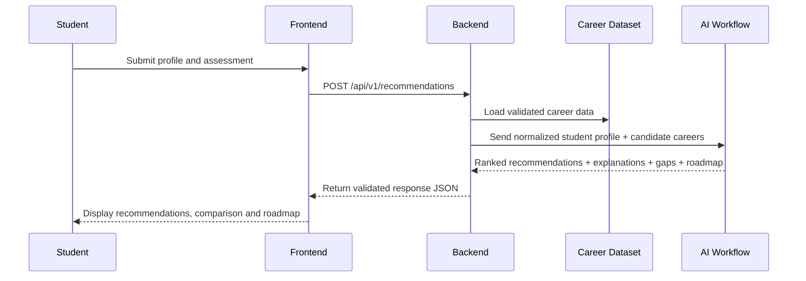

# Integration Contract

## Objective

Create one shared contract so UI/UX, frontend, backend, data, and AI build compatible modules from day one.

## End-to-End Flow



## Frontend-to-Backend Request

```json
{
  "student_id": "stu_001",
  "education_level": "class_12",
  "preferred_subjects": ["computer_science", "design"],
  "interests": ["technology", "creativity", "problem_solving"],
  "skills": [
    {
      "name": "basic_coding",
      "level": "beginner",
      "evidence": "school project"
    }
  ],
  "career_goals": ["high_growth", "creative_work"],
  "learning_preferences": ["project_based", "visual"],
  "constraints": {
    "weekly_hours": 8,
    "budget_level": "low",
    "location_preference": "india"
  }
}
```

## Backend-to-AI Input

The backend must normalize field names and attach only validated career records.

```json
{
  "request_id": "req_001",
  "student_profile": {},
  "career_candidates": [],
  "scoring_weights": {
    "interest_alignment": 0.25,
    "skill_alignment": 0.20,
    "subject_alignment": 0.10,
    "education_compatibility": 0.10,
    "career_goal_alignment": 0.15,
    "learning_preference_fit": 0.10,
    "constraint_compatibility": 0.10
  }
}
```

## AI-to-Backend Output

```json
{
  "request_id": "req_001",
  "profile_confidence": "medium",
  "recommendations": [],
  "comparison_ready": true,
  "warnings": []
}
```

The full object must conform to `schemas/recommendation-response.schema.json`.

## Backend API Surface

### `POST /api/v1/students`
Create a student profile.

### `GET /api/v1/students/{student_id}`
Fetch a saved profile.

### `PATCH /api/v1/students/{student_id}`
Update profile fields.

### `POST /api/v1/recommendations`
Generate ranked career recommendations.

### `POST /api/v1/comparisons`
Compare two careers using the same student profile.

### `GET /api/v1/careers/{career_id}`
Return validated career details.

### `GET /api/v1/roadmaps/{student_id}/{career_id}`
Return the latest 90-day roadmap.

### `POST /api/v1/feedback`
Store student feedback and recommendation relevance signals.

## Responsibility Boundaries

### Ojaswi — UI/UX
Design only against fields defined in the request and response schemas.

### Kartik — Frontend
Collect required inputs, call documented endpoints, and render response fields without inventing logic.

### Adarsh — Career Data
Use stable field names and provide source-ready records for backend ingestion.

### Aryan — AI Workflow
Implement ranking, explanation, gap analysis, comparison, and roadmap generation according to the product logic.

### Aditya — Backend
Own persistence, validation, APIs, AI invocation, error handling, and response delivery.

### Titiksha — Product Intelligence & Integration
Own the product rules, schemas, acceptance criteria, cross-team alignment, and final flow validation.

## Integration Rules

1. No team member changes shared field names without agreement.
2. AI output must be valid JSON and pass schema validation.
3. Frontend must not calculate match scores independently.
4. Backend must not fabricate missing career data.
5. UI states must include loading, empty, low-confidence, and error conditions.
6. Every roadmap item must trace back to a detected skill gap.
7. Every recommendation reason must trace back to student input or approved career data.

## Error Response

```json
{
  "error": {
    "code": "INSUFFICIENT_PROFILE_DATA",
    "message": "More information is required before reliable recommendations can be generated.",
    "missing_fields": ["skills", "career_goals"]
  }
}
```

## Definition of Integrated

The system is integrated only when a real frontend submission travels through the backend, invokes the AI workflow with validated career data, returns schema-valid results, and renders the result without manual copying.
